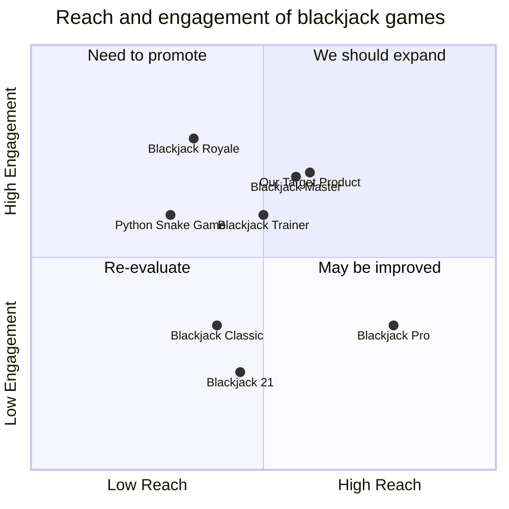

## Original Requirements:

The boss wants us to create a blackjack game.

## Product Goals:
```python
[
    "Create a fun and engaging blackjack game",
    "Provide a user-friendly interface",
    "Ensure smooth gameplay and accurate card dealing"
]
```

## User Stories:
```python
[
    "As a user, I want to be able to start a new game of blackjack",
    "As a user, I want to be able to place bets and make decisions during the game",
    "As a user, I want to see my current balance and track my wins and losses",
    "As a user, I want to be able to customize the game settings, such as the number of decks used",
    "As a user, I want to be able to view the game rules and instructions"
]
```

## Competitive Analysis:
```python
[
    "Python Snake Game: A popular snake game with simple graphics and addictive gameplay",
    "Blackjack 21: A well-designed blackjack game with realistic card animations and sound effects",
    "Blackjack Master: A comprehensive blackjack game with various game modes and difficulty levels",
    "Blackjack Pro: A professional blackjack game with advanced strategies and statistics tracking",
    "Blackjack Classic: A classic blackjack game with a clean and intuitive interface",
    "Blackjack Royale: A multiplayer blackjack game with real-time online gameplay",
    "Blackjack Trainer: A blackjack training app that helps players improve their skills"
]
```

## Competitive Quadrant Chart:


## Requirement Analysis:
The product should be a blackjack game that provides an enjoyable and realistic gameplay experience. It should have a user-friendly interface and allow users to customize game settings. The game should accurately deal cards and provide clear instructions and rules.

## Requirement Pool:
```python
[
    ("End game screen with win/loss message and option to start a new game", "P0"),
    ("Ability to place bets and make decisions during the game", "P0"),
    ("Display current balance and track wins and losses", "P1"),
    ("Customizable game settings, such as the number of decks used", "P1"),
    ("Game rules and instructions accessible from the main menu", "P2")
]
```

## UI Design draft:
The UI should include the following elements:
- Start button to begin a new game
- Betting area to place bets
- Decision buttons (hit, stand, double down, split)
- Balance display to show current balance
- Win/loss message at the end of the game
- Game settings menu to customize options
- Rules and instructions accessible from the main menu

The style should be clean and modern, with a clear and intuitive layout.

## Anything UNCLEAR:
There are no unclear points.