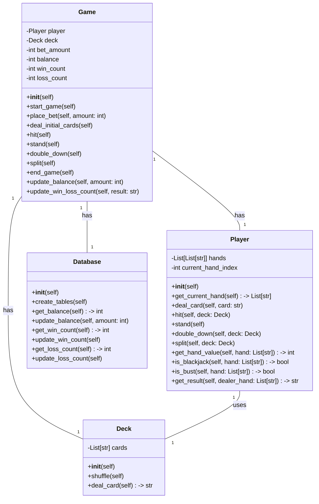
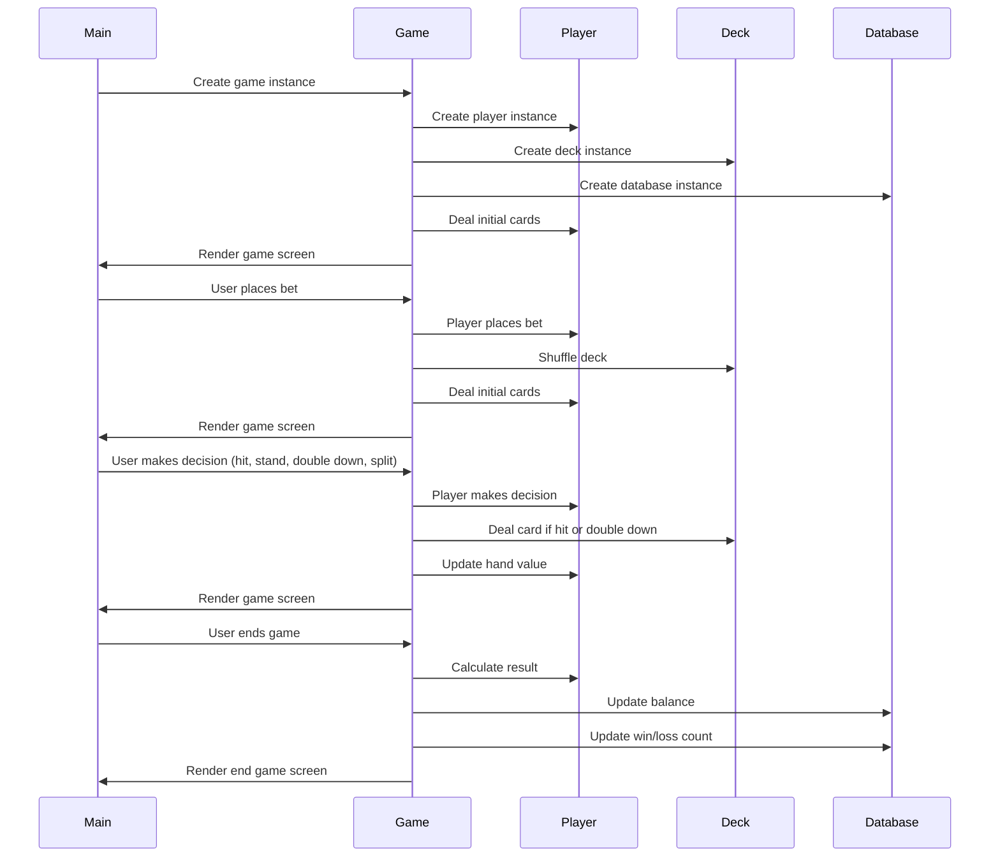

## Implementation approach:
To implement the blackjack game, we will use the following open-source tools:

1. Pygame: A popular library for game development in Python. It provides functionality for creating game windows, handling user input, and rendering graphics.

2. Random: A built-in Python module that will be used to shuffle the deck of cards.

3. SQLite: A lightweight database engine that will be used to store and retrieve game data, such as the player's balance and win/loss history.

## Python package name:
```python
"blackjack_game"
```

## File list:
```python
[
    "main.py",
    "game.py",
    "deck.py",
    "player.py",
    "database.py"
]
```

## Data structures and interface definitions:


## Program call flow:


## Anything UNCLEAR:
The requirements are clear to me.