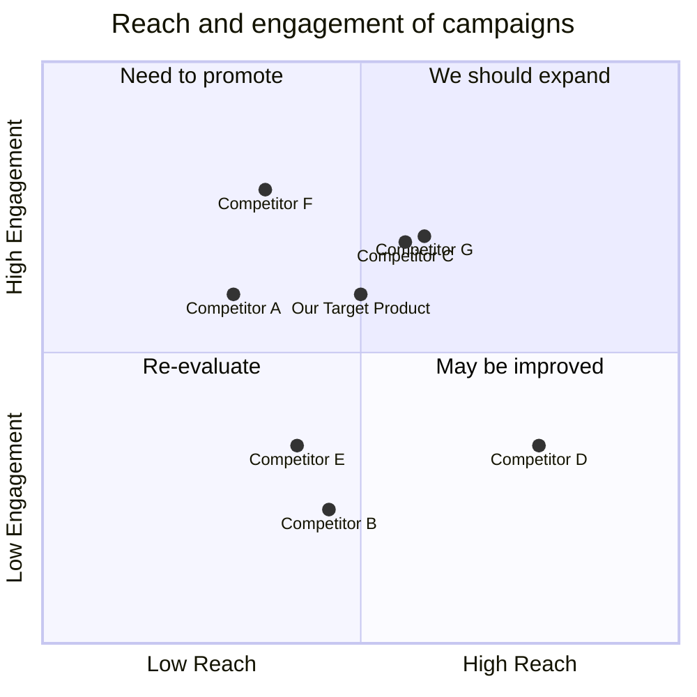

## Original Requirements:
The boss wants to create a website where users can play poker. The project needs to be executed in Japanese, except for the program code which should be in English. Documentation should also be in Japanese.

## Product Goals:
- Create a user-friendly and engaging online poker platform.
- Provide a seamless and enjoyable poker playing experience.
- Attract and retain a large user base.

## User Stories:
- As a user, I want to be able to create an account and login to the poker website.
- As a user, I want to be able to join different poker tables and play against other players.
- As a user, I want to be able to customize my avatar and profile settings.
- As a user, I want to be able to chat with other players during the game.
- As a user, I want to be able to view my game history and statistics.

## Competitive Analysis:
- Competitor A: Offers a wide variety of poker games and tournaments.
- Competitor B: Provides a user-friendly interface and seamless gameplay experience.
- Competitor C: Offers a mobile app for playing poker on the go.
- Competitor D: Provides a comprehensive tutorial for beginners.
- Competitor E: Offers a loyalty program with rewards for frequent players.
- Competitor F: Provides a social aspect to poker playing, allowing users to connect with friends.
- Competitor G: Offers a secure and fair gaming environment.

## Competitive Quadrant Chart:


## Requirement Analysis:
The product should be a web-based poker platform that allows users to create accounts, login, join poker tables, play against other players, customize their avatars and profiles, chat with other players, view game history and statistics. The platform should be user-friendly, engaging, and provide a seamless gameplay experience. It should also offer a secure and fair gaming environment.

## Requirement Pool:
```python
[
    ("End game notifications should be sent to players.", "P0"),
    ("Implement a chat feature for players to communicate during the game.", "P1"),
    ("Allow players to customize their avatars and profile settings.", "P1"),
    ("Provide a comprehensive tutorial for beginners.", "P2"),
    ("Implement a loyalty program with rewards for frequent players.", "P2")
]
```

## UI Design draft:
The UI design should include the following elements and functions:
- Login and registration forms.
- Lobby page to browse and join poker tables.
- Poker table interface with cards, chips, and action buttons.
- Avatar customization options.
- Chat box to communicate with other players.
- Profile page to view game history and statistics.

The style should be clean and modern, with intuitive navigation and responsive layout.

## Anything UNCLEAR:
There are no unclear points.