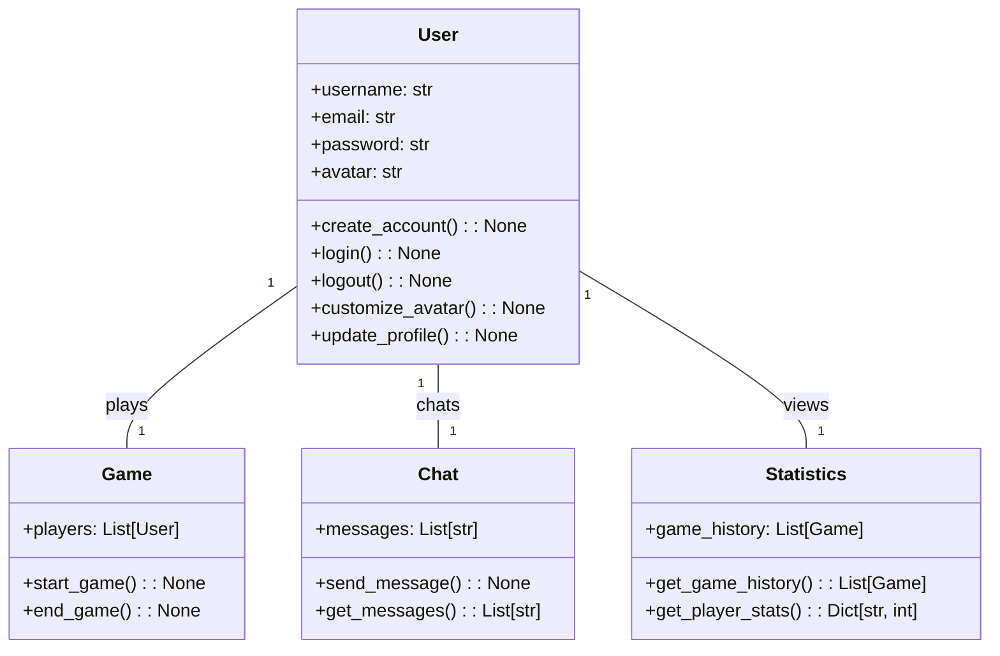
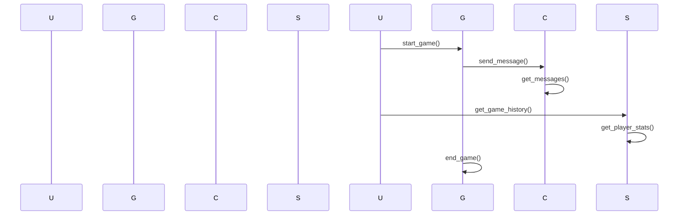

## Implementation approach:
For the web-based poker platform, we will use the Django framework, which is a high-level Python web framework that follows the model-view-controller (MVC) architectural pattern. Django provides a robust set of tools and features for building web applications, including user authentication, database management, and template rendering.

To create a seamless gameplay experience, we will use JavaScript and AJAX to handle real-time updates and interactions on the client-side. This will allow players to join poker tables, play against other players, and chat with each other without having to refresh the page.

For the avatar customization feature, we can use the Gravatar service, which allows users to create and manage avatars associated with their email addresses. This will provide a simple and standardized way for users to customize their avatars.

To implement the chat feature, we can use Django Channels, which is a library that extends Django to handle WebSockets and other asynchronous protocols. This will allow players to communicate with each other in real-time during the game.

For game history and statistics, we can use a PostgreSQL database to store and retrieve player data. Django provides built-in support for working with PostgreSQL, making it easy to manage and query the data.

To ensure a secure and fair gaming environment, we can use the Django authentication system to handle user registration and login. We can also implement measures such as rate limiting and input validation to prevent abuse and cheating.

## Python package name:
```python
"poker_platform"
```

## File list:
```python
[
    "main.py",
    "models.py",
    "views.py",
    "templates/",
    "static/",
    "urls.py",
    "settings.py",
    "requirements.txt"
]
```

## Data structures and interface definitions:


## Program call flow:


## Anything UNCLEAR:
The requirements are clear to me.